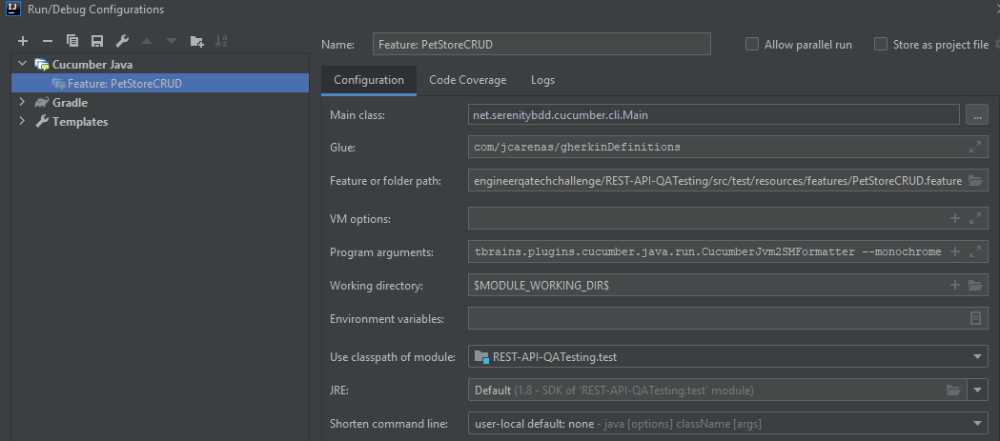

# REST-API-QATesting
QA Testing exercise using RestAssured and SerenityBDD

DEMO PET STORE API automation.

Based on seed-tas-serenitybdd-be-restapi

## Getting Started

### Prerequisites

Any software to clone this repository (e.g. SourceTree, Git installed locally...)

**NOTE:** Gradle local installation is not needed because is integrated in the project with the Wrapper.

### Installing

Clone this repository

## Running the tests
**From terminal using gradle**
```
gradlew clean test aggregate
```

**Running Cucumber with Serenity feature files directly from IntelliJ**

Details Here: https://johnfergusonsmart.com/running-cucumber-serenity-feature-files-directly-intellij/

<br/>


## Content and features
- serenity.properties
```
# To share data between scenarios. In other case, session is reset each time. Default value: false
serenity.maintain.session = true
```